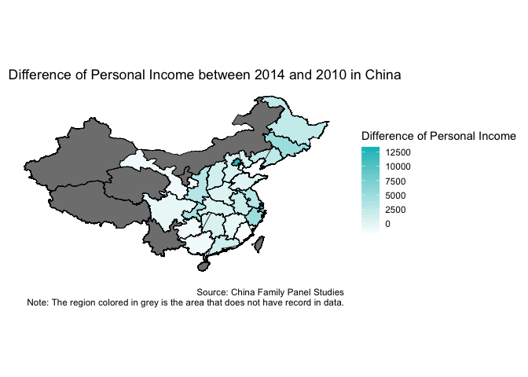
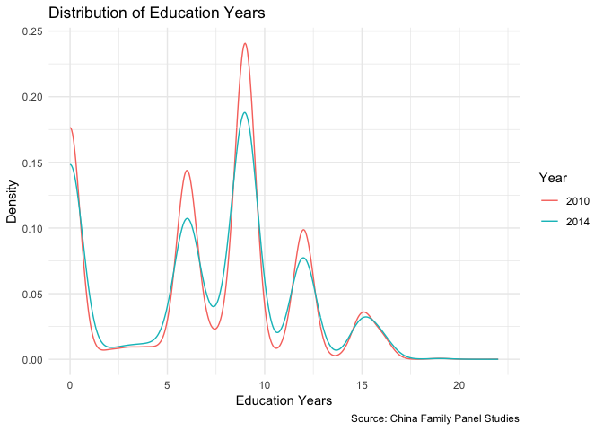
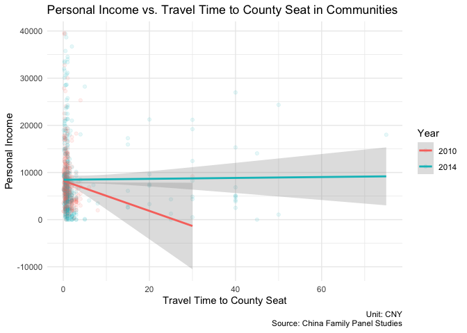

Data Visualization for Paper
================
Alice Mee Seon Chung and Ningyin Xu

# Graphs

<!-- -->

## China Map

<!-- -->

<!-- -->

<!-- -->

## Distribution of each variable and Relationship with Personal Income in China

### Individual Level

<!-- --><!-- -->

<!-- --><!-- -->

<!-- --><!-- -->

<!-- --><!-- -->

### Residential Community Level

<!-- --><!-- -->

<!-- --><!-- -->

<!-- --><!-- -->

<!-- --><!-- -->

<!-- --><!-- -->

<!-- --><!-- -->

<!-- --><!-- -->

<!-- --><!-- -->

<!-- --><!-- -->

<!-- --><!-- -->

## Linear Regression Model

### Correlation Plot

### Coefficient Plot

